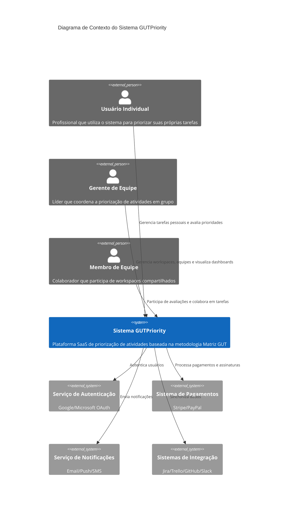

# Diagrama de Contexto - GUTPriority

Este diagrama de contexto C4 mostra a visão geral do sistema GUTPriority e suas interações com usuários e sistemas externos.

## Descrição dos Elementos

### Atores (Pessoas)

1. **Usuário Individual**
   - Profissionais que utilizam o sistema para priorização pessoal
   - Gerencia suas próprias tarefas e avaliações GUT
   - Visualiza relatórios individuais

2. **Gerente de Equipe**
   - Coordena workspaces e equipes
   - Define permissões e papéis
   - Analisa dashboards e métricas
   - Toma decisões baseadas em dados

3. **Membro de Equipe**
   - Participa de workspaces compartilhados
   - Contribui com avaliações GUT
   - Colabora em tarefas da equipe

### Sistema Principal

**GUTPriority**
- Plataforma SaaS de priorização
- Implementa a metodologia Matriz GUT
- Gerencia workspaces, tarefas e avaliações
- Fornece visualizações e relatórios
- Permite colaboração em tempo real

### Sistemas Externos

1. **Serviço de Autenticação**
   - Autenticação via Google/Microsoft
   - Gerenciamento de sessões
   - Single Sign-On (SSO)

2. **Sistema de Pagamentos**
   - Processamento de pagamentos
   - Gestão de assinaturas
   - Faturamento recorrente

3. **Serviço de Notificações**
   - Envio de emails
   - Notificações push
   - Alertas SMS

4. **Sistemas de Integração**
   - Integração com Jira
   - Integração com Trello
   - Integração com GitHub
   - Integração com Slack 