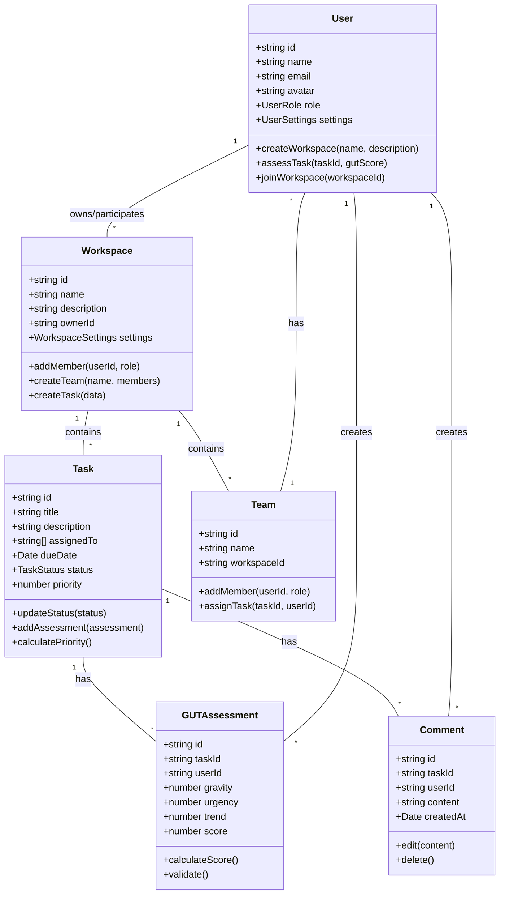

# Modelo de Domínio - GUTPriority

## Entidades

- `User`
- `Workspace`
- `Task`
- `GUTAssessment`
- `Team`
- `Comment`
- `Notification`
- `Integration`

## Atributos e Operações

### `User`

- ID: string
- Name: string
- Email: string
- Avatar: string
- Role: UserRole
- Settings: UserSettings
- `createWorkspace(name: string, description: string)`
- `assessTask(taskId: string, gutScore: GUTScore)`
- `joinWorkspace(workspaceId: string)`
- `updateProfile(profile: UserProfile)`

### `Workspace`

- ID: string
- Name: string
- Description: string
- OwnerId: string
- Teams: Team[]
- Members: User[]
- Tasks: Task[]
- Settings: WorkspaceSettings
- `addMember(userId: string, role: WorkspaceRole)`
- `createTeam(name: string, members: string[])`
- `createTask(data: TaskData)`
- `generateReport(filters: ReportFilters)`

### `Task`

- ID: string
- Title: string
- Description: string
- CreatedBy: string
- AssignedTo: string[]
- DueDate: Date
- Status: TaskStatus
- Tags: string[]
- Priority: number
- Attachments: Attachment[]
- Comments: Comment[]
- GUTAssessments: GUTAssessment[]
- Dependencies: Task[]
- `updateStatus(status: TaskStatus)`
- `addAssessment(assessment: GUTAssessment)`
- `calculatePriority()`
- `addComment(comment: Comment)`

### `GUTAssessment`

- ID: string
- TaskId: string
- UserId: string
- Gravity: number
- Urgency: number
- Trend: number
- Score: number
- CreatedAt: Date
- Notes: string
- `calculateScore()`
- `validate()`

### `Team`

- ID: string
- Name: string
- Description: string
- WorkspaceId: string
- Members: User[]
- Tasks: Task[]
- `addMember(userId: string, role: TeamRole)`
- `removeMember(userId: string)`
- `assignTask(taskId: string, userId: string)`

### `Comment`

- ID: string
- TaskId: string
- UserId: string
- Content: string
- CreatedAt: Date
- Attachments: Attachment[]
- `edit(content: string)`
- `delete()`

### `Notification`

- ID: string
- UserId: string
- Type: NotificationType
- Content: string
- RelatedId: string
- CreatedAt: Date
- ReadAt: Date
- `markAsRead()`
- `dismiss()`

### `Integration`

- ID: string
- WorkspaceId: string
- Type: IntegrationType
- Config: IntegrationConfig
- Status: IntegrationStatus
- `sync()`
- `validate()`
- `disconnect()`

## Diagrama de Classes

## Tipos e Enums

### UserRole
- ADMIN
- MEMBER

### WorkspaceRole
- OWNER
- ADMIN
- MEMBER
- VIEWER

### TaskStatus
- TODO
- IN_PROGRESS
- COMPLETED
- BLOCKED
- CANCELLED

### NotificationType
- TASK_ASSIGNED
- TASK_UPDATED
- ASSESSMENT_ADDED
- COMMENT_ADDED
- DUE_DATE_APPROACHING
- WORKSPACE_INVITATION

### IntegrationType
- JIRA
- TRELLO
- SLACK
- GITHUB

## Agregados

1. **Workspace Aggregate**
   - Root: Workspace
   - Entities: Team, Task
   - Value Objects: WorkspaceSettings

2. **Task Aggregate**
   - Root: Task
   - Entities: GUTAssessment, Comment
   - Value Objects: TaskStatus, Priority

3. **User Aggregate**
   - Root: User
   - Value Objects: UserSettings, UserProfile

## Invariantes de Domínio

1. Uma tarefa só pode ter avaliações GUT de membros do mesmo workspace
2. A pontuação GUT total deve ser calculada como G × U × T
3. Apenas membros com permissão adequada podem criar/editar tarefas
4. Uma tarefa não pode depender de si mesma (ciclos de dependência)
5. Um usuário não pode pertencer ao mesmo workspace mais de uma vez
6. A data de vencimento de uma tarefa não pode ser anterior à data de criação 